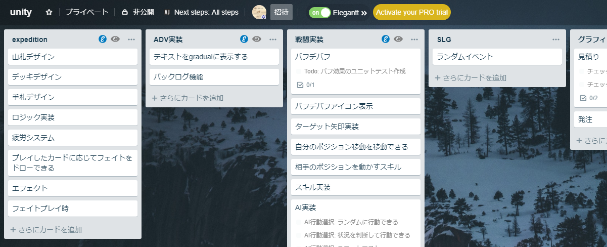

# タスク管理のススメ

**★ネタ帳になる**
- アイデアを思いついても、忘れてしまったら意味がない
  - 完全な忘却ならばまだよいが、**かつて頭の中に何かクールなイメージが沸いたという曖昧な記憶だけが残る状態**は苦痛である

**★仕掛かりの管理**
- タスクの処理に対する見通しも、日によって違ったりする
  - **あるタイミングで簡単に詳細がイメージできるタスクも、別のタイミングでは闇の中だったりする**
  - アイデアの時点では全く見通せていないタスクも、温めているうちに仕上がる
    - 「意欲を持ち続けていれば、見たり聞いたり行ったりするすべてのことが、作品を生み出すきっかけとなる」 ―― H.R.F.キーティング
  - 他のタスクがヒントになったり、自分のスキルが上がって簡単になる

**★小さなタスクが、やる気のない時に光る**
- そもそもやる気というものは流動的である
  - 最終的な成果物が変わらないなら、ノった時にこなせばよい
    - ※ただし往々にして、ノっている時の方が成果物の質もよい
  - **やる気がない時にアウトプットを出すためには、簡単なタスクを貯めておくことが重要**
    - 「やる気ぜんぜん出ないけど、まぁこれならやってもいいかな」という粒度
    - 手を動かし始めてしまえば、それがきっかけでノり始めるのはありがち
      - 簡単なタスクは、一種の種火である

# Trelloを使う

- https://trello.com
  - ブラウザベースのタスク管理Webアプリ
  - **無料は強い**
- いわゆるタスク管理にも様々あるが、カンバン方式は上述の目的に非常にマッチ
  - ガントチャートなどスケジュール調整に寄ったタスク管理には余り向かない
    - と言いつつchrome拡張で対応できます(https://elegantt.com/)
- より細かなTodoを表示するために、chrome拡張のNextStepForTrelloをおすすめします
  - https://chrome.google.com/webstore/detail/next-step-for-trello
- ファイル管理などの機能はないので、複数人でのコラボレーションにも弱い
  - 必要ならbacklogなど少々コストがかかる上位互換をおすすめします

# 個人的な運用具体例
- しっかり運用はしない
  - 本業が別にあるなら特に、ゆるく置いておく
    - ただし粛々と進めるようには気を付ける
  - 守れないのでスケジュール管理もしない
    - 体が資本なので、締め切り駆動で無理したりは絶対にしない
- 今やる気は一切ないが一応やるつもりのネタを書いておく
  - 明日から頑張る
- 「具体的にどうと言われると困るけどこれを作る」程度のものもトピックにしておく
  - 目処が立ったら具体的に書く
- いざ手をつけてみるとやることが色々あるので細分化する
  - カード内のチェックリストとして段階的に処理
    - NextStepForTrelloでAllにしておくと便利
- あまり最初からガッツリ作り込みたくはなく、プロトタイプから様子を見てステップアップしたい
  - カード内チェックリストとして管理
  - 「まずはとりあえずこれができる」「次はちゃんと動くためにこれができる」といった粒度
- Todoが可視化できるので、絶望的にやる気が出ない時でも並んだカードから「これが一番マシかな……」といった感じで渋々選ぶ
  - いざやりはじめるとアレもコレもやりはじめる
- スマホでも使えるのをいいことにノートを分けて日常の買い物Todoなどに
  - 地味に便利

# まとめ
- モチベーションは大事
- タスク管理はモチベーション管理に意外とつながるので割と大事
